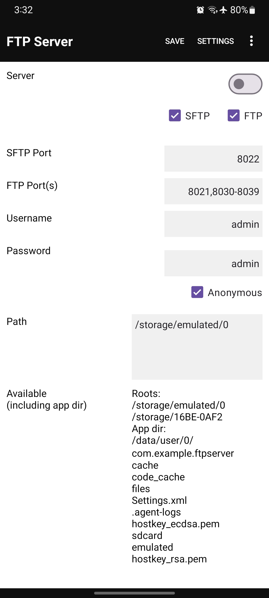

# Android FTP Server

Host SFTP / FTP server on your phone.
\
\
Features
- SFTP server
- FTP server
- Option to specify port numbers
- Option to specify username and password
- FTP anonymous mode
- Supports ECDSA and RSA 4096
- Works with Kodi and VLC
- Symlinks (details below)
\
\
\
Permissions (required, not optional)
- All files access
- Notifications
\
\
## Symlinks
You can access a removable sotrage like SDCard or USB drive by creating a symlink to its mount point.
Multiple locations like Internal storage and SDCard can be accessed simultaneously under a single directory.
\
\
\

## Screenshots

